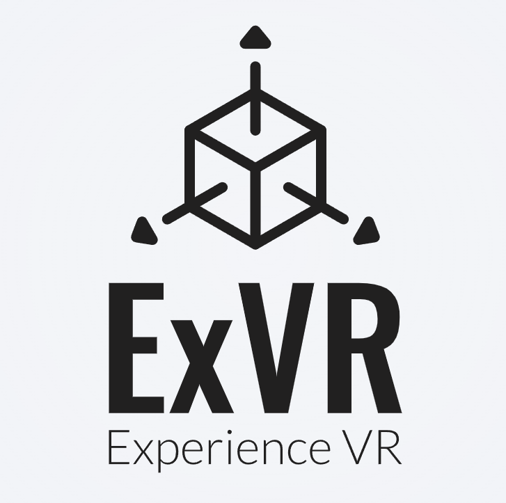

    

<!--

    <a href="https://exvr-doc.github.io/#/zh-cn/guide" style="margin: 0 15px; text-decoration: none; color: #2c3e50; font-weight: 1500">快速入门</a>
    <a href="https://exvr-doc.github.io/#/zh-cn/extra" style="margin: 0 15px; text-decoration: none; color: #2c3e50; font-weight: 1500">扩展功能</a>
    <a href="https://exvr-doc.github.io/#/zh-cn/problems_list" style="margin: 0 15px; text-decoration: none; color: #2c3e50; font-weight: 1500">常见问题</a>

-->

<!-- 简介卡片 -->

    <h1 style="color: #2c3e50; text-align: center; margin-bottom: 20px">欢迎来到 ExVR帮助文档</h1>
    

        请仔细阅读帮助文档 
        当前帮助文档未完善 
        祝您拥有愉快的游玩体验
    

    

        <h3>感谢所有项目贡献人员(排名不分先后)</h3>
        
xxx

    

    

        <h3>参考项目列表</h3>
        <h3>Tracking Module</h3>
        <ul>
            <li><a href="https://github.com/nuekaze/mediapipe-vt" style="color: #0000ff">mediapipe-vt</a></li>
            <li><a href="https://github.com/ju1ce/Mediapipe-VR-Fullbody-Tracking/" style="color: #0000ff">Mediapipe-VR-Fullbody-Tracking</a></li>
        </ul>
        <h3>HMD OpenVR Drivers</h3>
        <ul>
            <li><a href="https://github.com/r57zone/OpenVR-OpenTrack" style="color: #0000ff">OpenVR-OpenTrack</a></li>
            <li><a href="https://github.com/oneup03/VRto3D" style="color: #0000ff">VRto3D</a></li>
        </ul>
        <h3>Hand OpenVR Driver</h3>
        <ul>
            <li><a href="https://github.com/gpsnmeajp/VirtualMotionTracker/" style="color: #0000ff">VMT (Virtual Motion Tracker)</a></li>
        </ul>
        <h3>VRCFaceTracking Module</h3>
        <ul>
            <li><a href="https://github.com/Codel1417/VRCFT-MediaPipe" style="color: #0000ff">VRCFT-MediaPipe</a></li>
            <li><a href="https://github.com/kusomaigo/VRCFaceTracking-LiveLink/" style="color: #0000ff">VRCFaceTracking-LiveLink</a></li>
        </ul>
    

    © 2025 ExVR.

